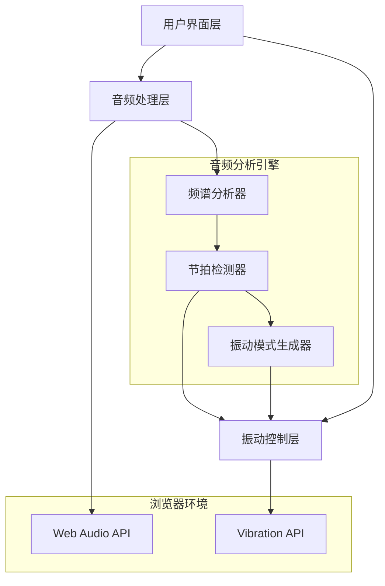
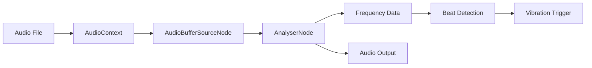
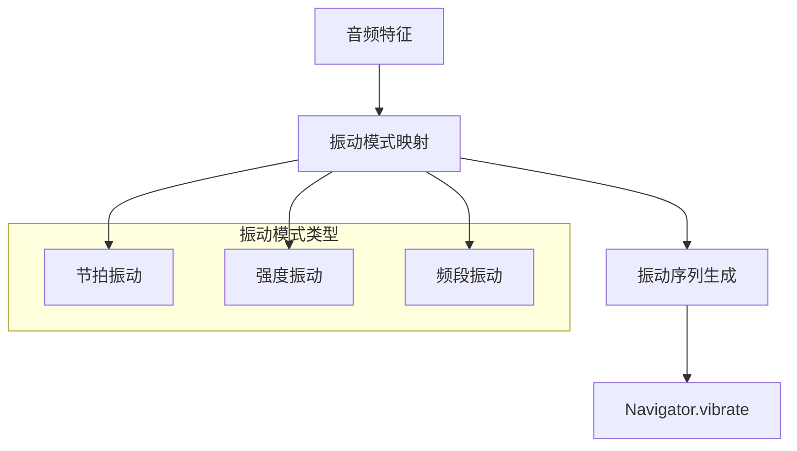
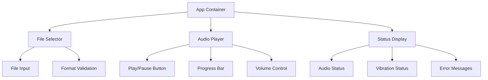
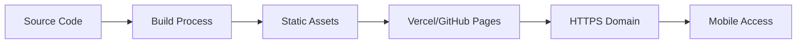

# Design Document

## Introduction

本设计文档描述了一个音频振动同步网页应用的技术架构和实现方案。该应用将利用Web Audio API进行音频分析，结合Vibration API实现音乐律动的振动反馈，为用户提供类似微信铃声的沉浸式体验。

## Architecture Overview

### System Architecture



### Component Relationship

应用采用模块化设计，主要包含以下核心组件：

1. **用户界面层**：负责文件选择、播放控制和状态显示
2. **音频处理层**：处理音频文件加载、播放和实时分析
3. **振动控制层**：根据音频特征生成并执行振动模式
4. **音频分析引擎**：提供频谱分析和节拍检测功能

## Technical Design

### Audio Processing Module

#### Core Technology
使用Web Audio API的AnalyserNode进行实时音频分析 <kreference link="https://12devsofxmas.co.uk/2017/01/day-12-beat-dis-re-addressing-audio-analysis/index.html" index="4">[^4]</kreference>：



#### Frequency Analysis Implementation
- 使用2048大小的FFT进行频谱分析
- 重点分析0-5000Hz频段，覆盖音乐主要频率范围 <kreference link="https://12devsofxmas.co.uk/2017/01/day-12-beat-dis-re-addressing-audio-analysis/index.html" index="4">[^4]</kreference>
- 实现对数频率分布以更好匹配音乐特性

#### Beat Detection Algorithm
采用基于频谱通量的节拍检测算法：
1. 计算连续帧之间的频谱差异
2. 检测能量峰值作为潜在节拍点
3. 应用自适应阈值过滤噪声
4. 输出节拍时间戳和强度信息

### Vibration Control Module

#### Core Technology
基于Web Vibration API实现设备振动控制 <kreference link="https://developer.mozilla.org/en-US/docs/Web/API/Vibration_API" index="3">[^3]</kreference>：



#### Vibration Pattern Design
参考微信铃声振动效果 <kreference link="https://www.richtap-haptics.com/post/wechat" index="2">[^2]</kreference>，设计多层次振动模式：

1. **节拍振动**：基于检测到的节拍触发短促振动（50-200ms）
2. **强度振动**：根据音量变化调整振动强度
3. **频段振动**：低频强振动，高频轻振动，模拟音乐层次感

#### Vibration Mapping Algorithm
```javascript
// 伪代码示例
function generateVibrationPattern(audioFeatures) {
    const { beat, volume, frequency } = audioFeatures;
    
    if (beat.detected) {
        const intensity = Math.min(volume * 200, 400);
        const pattern = [intensity, 50]; // 振动时长，停顿时长
        return pattern;
    }
    
    // 基于频率的连续振动
    if (frequency.bass > threshold) {
        return [100, 100]; // 低频强振动
    }
    
    return null; // 无振动
}
```

### User Interface Module

#### Design Principles
- 简洁直观的操作界面
- 实时反馈音频和振动状态
- 移动端友好的触摸交互

#### Component Structure


### Audio Format Support

#### Supported Formats
基于浏览器兼容性选择音频格式 <kreference link="https://developer.mozilla.org/en-US/docs/Web/Media/Guides/Audio_and_video_delivery/Cross-browser_audio_basics" index="1">[^1]</kreference>：

| 格式 | 移动端支持 | 优先级 |
|------|------------|--------|
| MP3  | 优秀       | 高     |
| AAC  | 优秀       | 高     |
| OGG  | 良好       | 中     |
| WAV  | 良好       | 低     |

#### Format Detection
```javascript
function detectAudioSupport() {
    const audio = new Audio();
    const formats = {
        mp3: audio.canPlayType('audio/mpeg'),
        aac: audio.canPlayType('audio/mp4'),
        ogg: audio.canPlayType('audio/ogg')
    };
    return formats;
}
```

## Implementation Strategy

### Development Phases

#### Phase 1: Core Audio Player
1. 实现基础音频播放功能
2. 创建简洁的用户界面
3. 添加文件选择和格式验证

#### Phase 2: Audio Analysis
1. 集成Web Audio API
2. 实现频谱分析功能
3. 开发节拍检测算法

#### Phase 3: Vibration Integration
1. 实现振动API调用
2. 设计振动模式映射
3. 优化振动与音频同步

#### Phase 4: Mobile Optimization
1. 优化移动端用户体验
2. 处理浏览器兼容性问题
3. 实现响应式设计

### Browser Compatibility Strategy

#### Vibration API Support
- **Android Chrome/Firefox**: 完全支持
- **iOS Safari**: 不支持，需要优雅降级 <kreference link="https://developer.mozilla.org/en-US/docs/Web/API/Vibration_API" index="3">[^3]</kreference>
- **其他浏览器**: 检测支持情况并相应处理

#### Fallback Strategy
```javascript
function initVibration() {
    if ('vibrate' in navigator) {
        return new VibrationController();
    } else {
        console.warn('Vibration API not supported');
        return new MockVibrationController();
    }
}
```

### Performance Considerations

#### Audio Processing Optimization
- 使用requestAnimationFrame优化分析频率
- 实现音频数据缓存减少重复计算
- 限制振动触发频率避免过度振动

#### Memory Management
- 及时释放AudioBuffer资源
- 清理定时器和事件监听器
- 实现音频上下文的生命周期管理

## Deployment Architecture

### Static Site Deployment



#### Deployment Platforms
1. **Vercel** (主选择)
   - 自动HTTPS
   - 全球CDN
   - 简单部署流程

2. **GitHub Pages** (备选)
   - 免费托管
   - 与代码仓库集成
   - 自定义域名支持

### Security Considerations
- 使用HTTPS确保安全访问
- 实现文件类型验证防止恶意文件
- 限制文件大小避免资源滥用

## Error Handling & Edge Cases

### Error Scenarios

| 场景 | 处理方案 | 用户反馈 |
|------|----------|----------|
| 不支持的音频格式 | 显示格式错误信息 | "请选择MP3、AAC或OGG格式的音频文件" |
| 振动API不可用 | 优雅降级到纯音频模式 | "振动功能在此设备上不可用，但音频播放正常" |
| 音频加载失败 | 重试机制和错误提示 | "音频文件加载失败，请检查文件是否损坏" |
| 网络连接问题 | 离线缓存和重连机制 | "网络连接不稳定，正在重试..." |

### Boundary Conditions
- 文件大小限制：最大50MB
- 音频时长限制：最大30分钟
- 振动频率限制：最高10Hz避免设备过热
- 浏览器内存限制：实现音频流式处理

## Testing Strategy

### Unit Testing
- 音频分析算法准确性测试
- 振动模式生成逻辑测试
- 文件格式检测功能测试

### Integration Testing
- 音频播放与振动同步测试
- 跨浏览器兼容性测试
- 移动设备真机测试

### Performance Testing
- 音频处理性能基准测试
- 内存使用情况监控
- 电池消耗影响评估

  [^1]: https://developer.mozilla.org/en-US/docs/Web/Media/Guides/Audio_and_video_delivery/Cross-browser_audio_basics
  [^2]: https://www.richtap-haptics.com/post/wechat
  [^3]: https://developer.mozilla.org/en-US/docs/Web/API/Vibration_API
  [^4]: https://12devsofxmas.co.uk/2017/01/day-12-beat-dis-re-addressing-audio-analysis/index.html